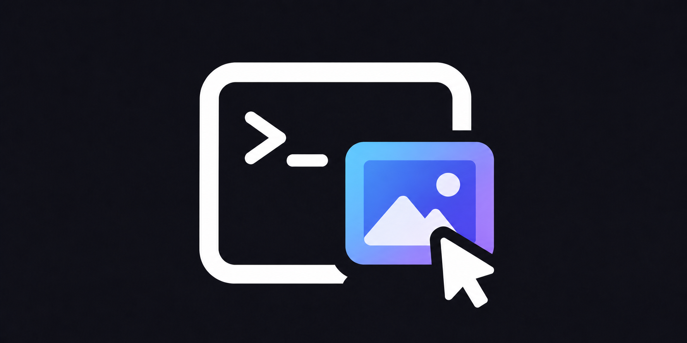
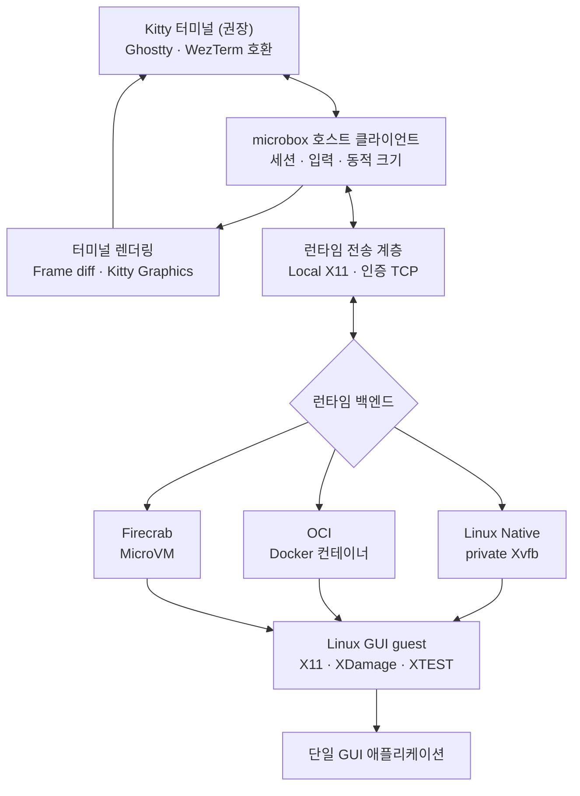

<p align="center">
  
</p>

<h1 align="center">microbox</h1>

<p align="center"><strong>데스크톱 없이 사용하는 GUI 애플리케이션.</strong></p>

<p align="center"><a href="README.md">English</a> · 한국어</p>

microbox는 Linux GUI 애플리케이션 하나를 터미널 명령처럼 실행하는 경량 GUI
런타임입니다. Kitty Graphics Protocol로 화면을 렌더링하고 키보드·마우스 입력과
터미널 픽셀 크기 변경을 애플리케이션에 전달하며, 전체 프로세스 생명주기를
관리합니다. 데스크톱 환경, VNC, RDP 클라이언트가 필요하지 않습니다.

> 현재 상태: pre-alpha. Linux Native/OCI와 macOS OCI-agent/Firecrab 호스트
> 경로가 구현되어 있습니다. [Kitty](https://sw.kovidgoyal.net/kitty/)를 기본
> 권장 및 우선 검증 터미널로 사용합니다. Kitty Graphics Protocol을 지원하는
> Ghostty, WezTerm 등의 터미널도 호환 경로로 사용할 수 있습니다.

## 플랫폼 지원

| 호스트 | Native | OCI | Firecrab |
| --- | --- | --- | --- |
| Linux | Xvfb 애플리케이션 | 앱 이미지 또는 agent 이미지 | 지원 |
| macOS Apple Silicon | — | Docker Desktop agent 이미지 | 지원 |
| macOS Intel | — | Docker Desktop agent 이미지 | 지원 |

macOS에서는 Linux 바이너리를 직접 실행할 수 없습니다. 따라서 Linux 앱, Xvfb,
`microbox agent`는 Docker Desktop 컨테이너 또는 Firecrab VM 안에서 실행되고,
macOS용 microbox 바이너리가 터미널 렌더링과 입력을 담당합니다. XQuartz는
필요하지 않습니다.

## 스택형 아키텍처



호스트 클라이언트는 터미널 I/O, 좌표 변환, 세션 생명주기를 담당합니다. Linux
Native는 전용 X11 display에 직접 연결하고, macOS OCI와 Firecrab은 동일한 토큰
인증 agent 프로토콜을 사용합니다. 초기 framebuffer와 이후 리사이즈 값은 고정
해상도가 아니라 현재 터미널의 실제 픽셀 크기에서 계산됩니다.

## 설치

공통 요구사항:

- Rust 1.85 이상
- Kitty 터미널 권장 또는 Kitty Graphics Protocol 호환 터미널

```sh
git clone https://github.com/SteelCrab/microbox.git
cd microbox
cargo install --path .
microbox doctor
```

설치하지 않고 빌드 결과만 사용하려면 `cargo build --release`를 실행합니다. 실행
파일은 `target/release/microbox`에 생성됩니다.

### Linux 의존성

Ubuntu/Debian:

```sh
sudo apt-get update
sudo apt-get install -y xvfb x11-apps x11-utils
./scripts/check-deps.sh
```

### macOS 의존성

Rust와 Docker Desktop을 설치합니다. Homebrew로 Rust를 설치할 수 있습니다.

```sh
brew install rust
./scripts/check-deps.sh
```

## 빠른 시작

### Linux Native

```sh
microbox run xeyes
microbox run firefox
microbox run my-app -- --application-argument
```

Native 백엔드는 전용 동적 Xvfb display를 만듭니다. 시작이 빠르지만 보안
샌드박스는 아니며, 앱이 호스트 커널·파일시스템·네트워크를 공유합니다.

### Linux OCI

```sh
docker build -t microbox/xeyes examples/oci-xeyes
microbox run microbox/xeyes
```

Linux OCI는 전용 X11 Unix socket만 컨테이너와 공유하고
`no-new-privileges`를 활성화합니다. 세션 종료 시 해당 disposable 컨테이너만
정확히 제거합니다.

### macOS OCI

앱, Xvfb, microbox guest agent가 포함된 이미지를 사용합니다.

```sh
docker build -f examples/firecrab-xeyes/Dockerfile \
  -t microbox/xeyes-agent .

microbox run microbox/xeyes-agent --runtime oci
```

호스트는 guest agent를 임의의 `127.0.0.1` 포트에만 게시하고, 자동 생성한
256-bit 토큰으로 인증합니다. Linux에서도 같은 전송 경로를 검증할 수 있습니다.

```sh
microbox run microbox/xeyes-agent --runtime oci-agent
```

### Firecrab

guest TCP 포트 `5943`을 호스트로 포워딩하고, guest와 같은 토큰으로 연결합니다.

```sh
MICROBOX_AGENT_TOKEN='RANDOM_SECRET' \
microbox run firefox \
  --runtime firecrab \
  --firecrab-endpoint 127.0.0.1:15943
```

guest 이미지와 포트 포워딩 설정은 [Firecrab 전송 가이드](docs/firecrab.md)를
참고하세요.

## 명령어

| 명령 | 설명 |
| --- | --- |
| `microbox doctor` | 터미널, 호스트 플랫폼, 런타임 진단 |
| `microbox demo` | X server 없이 생성한 테스트 frame 렌더링 |
| `microbox run APP` | GUI 애플리케이션 세션 실행 |
| `microbox ps` | 현재 사용자의 실행 중인 세션 조회 |
| `microbox stop ID` | PID 동일성을 검증한 뒤 세션 종료 |
| `microbox help` | CLI 도움말 출력 |

주요 `run` 옵션:

```text
--runtime native|oci|oci-agent|firecrab
--fps 1..60
--stats
--debug
--firecrab-endpoint HOST:PORT
-- APPLICATION_ARGUMENTS...
```

```sh
microbox run xeyes --fps 60 --stats
microbox run xeyes --debug
microbox run local-image --runtime oci
microbox run viewer -- --fullscreen 'a file.png'
```

포그라운드 세션은 `Ctrl-C`로 종료합니다. 다른 터미널에서도 조회하고 종료할 수
있습니다.

```sh
microbox ps
microbox stop gui-12345
```

세션 레코드는 Linux와 macOS 모두 현재 사용자만 읽을 수 있는 `0600` 모드로
저장되며 PID 재사용을 검증합니다. 정상 종료와 처리 가능한 신호 종료 뒤에는
자동으로 제거됩니다.

## 상세 디버깅

```sh
microbox doctor
microbox demo
microbox run xeyes --debug
```

`--debug`는 호스트 아키텍처, 선택한 런타임, 앱, FPS, 터미널 cell/pixel 크기,
초기 display 크기, 세션 ID/PID, 모든 동적 리사이즈, 최종 상태와 렌더 통계를
출력합니다. OCI/Firecrab 인증 토큰은 출력하지 않습니다.

OCI agent 세션에서는 guest 애플리케이션의 exit code 또는 signal, 예상하지 못한
TCP 단절, Docker 컨테이너 상태·exit code·OOM 여부·시각, 마지막 200줄의 제한된
container log도 출력합니다. 로그의 제어 문자는 제거되며 인증 토큰은 기록하지
않습니다. 진단을 수집한 뒤 컨테이너는 기존과 같이 자동 제거됩니다.

```sh
MICROBOX_DEBUG=1 microbox run microbox/xeyes-agent --runtime oci
```

OCI 시작 문제는 다음 순서로 확인합니다.

```sh
docker version
docker image inspect microbox/xeyes-agent
docker ps -a --filter 'name=^/microbox-'
```

Firecrab에서는 guest `5943` 포트가 `--firecrab-endpoint`의 loopback 주소로
포워딩되었는지, host와 guest의 `MICROBOX_AGENT_TOKEN`이 같은지 확인합니다.
프로토콜은 인증되지만 암호화되지 않으므로 포트를 외부에 공개하지 마세요.

## 런타임 동작

```text
Linux GUI 애플리케이션
        ↓
전용 X11/Xvfb display
        ↓
XDamage + MIT-SHM/GetImage 캡처
        ↓
전체 frame 또는 변경된 64px tile
        ↓
Kitty Graphics 터미널 렌더링
```

- framebuffer는 터미널이 보고한 픽셀 크기로 시작합니다.
- 픽셀 크기를 얻을 수 없으면 cell grid에서 안전한 값을 계산합니다.
- 실시간 리사이즈는 XRandR, 앱 window, 캡처 buffer, Kitty placement, 입력
  좌표에 함께 적용됩니다.
- framebuffer의 각 축은 최대 4096픽셀로 제한됩니다.
- 키보드와 마우스 이벤트는 XTEST로 주입됩니다.
- bracketed UTF-8 paste는 제한된 X11 clipboard selection으로 전달됩니다.
- XDamage로 변경 없는 frame을 건너뛰고, 출력이 느리면 대기열 대신 최신
  frame을 우선합니다.

## 개발 및 검증

```sh
cargo fmt --all -- --check
cargo test --all-targets
cargo clippy --all-targets --all-features -- -D warnings
./scripts/smoke-test.sh
```

CI는 Linux, Apple Silicon macOS, Intel macOS를 빌드하고 검사합니다. 실제 Xvfb
캡처, 입력, 동적 리사이즈, 장애 처리, OCI agent 전송, 결정적 cleanup도 전용
테스트로 검증합니다. 자세한 결과는
[동적 해상도 검증 보고서](docs/dynamic-resolution-validation.md)와
[릴리스 체크리스트](docs/release-checklist.md)를 참고하세요.

## 범위와 제한

- 세션당 포그라운드 GUI 애플리케이션 하나
- guest display는 X11/Xvfb 기반이며 Wayland는 향후 작업
- Native 실행은 Linux 전용
- macOS 로컬 실행은 agent 포함 Docker 이미지 필요
- Firecrab GUI data plane은 구현되었지만 VM/network/image control plane 정책은
  Firecrab의 별도 책임
- detachable 세션, 오디오, GUI → 터미널 clipboard 자동 export는 미구현

추가 문서:

- [설치 가이드](docs/install.md)
- [아키텍처](docs/architecture-v0.1.md)
- [로드맵](docs/roadmap.md)
- [Firecrab 전송](docs/firecrab.md)
- [성능 기준](docs/performance.md)

## 프로젝트 원칙

- 데스크톱 환경이 아닌 애플리케이션 런타임
- 명확한 생명주기 소유권과 결정적 cleanup
- 터미널 렌더링과 런타임 백엔드 분리
- Native, 컨테이너, MicroVM 보안 경계를 정확하게 설명
