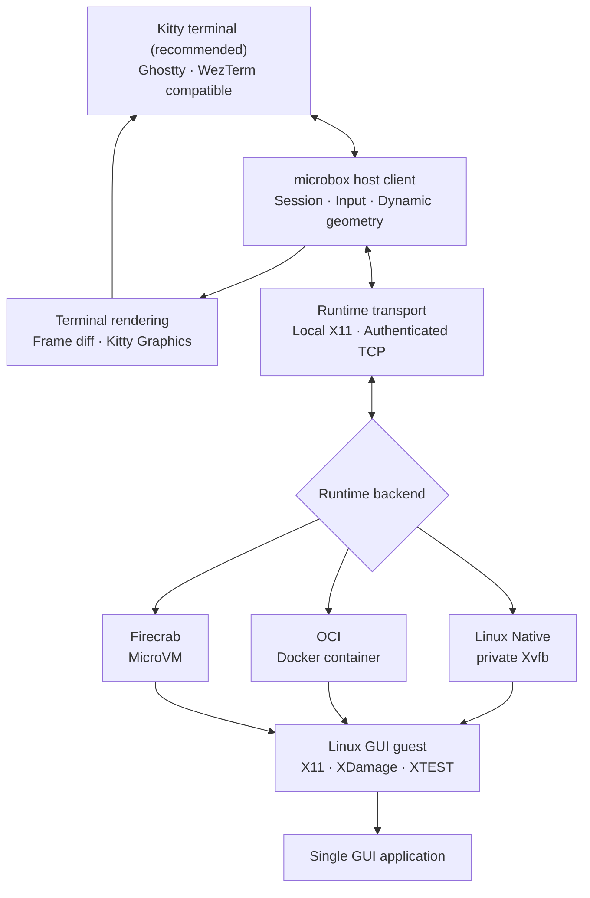

<p align="center">
  
</p>

<h1 align="center">microbox</h1>

<p align="center"><strong>GUI applications, without the desktop.</strong></p>

<p align="center">English · <a href="README.ko.md">한국어</a></p>

microbox runs one Linux GUI application as if it were a terminal command. It
renders the application with the Kitty Graphics Protocol, forwards keyboard and
mouse input, follows terminal pixel-size changes, and owns the complete process
lifecycle. No desktop environment, VNC, or RDP client is required.

> Status: pre-alpha. Linux Native/OCI and macOS OCI-agent/Firecrab host paths
> are implemented. [Kitty](https://sw.kovidgoyal.net/kitty/) is the recommended
> and primary validation terminal. Ghostty, WezTerm, and other terminals with
> Kitty Graphics Protocol support are compatible paths.

## Platform support

| Host | Native | OCI | Firecrab |
| --- | --- | --- | --- |
| Linux | Xvfb application | application image or agent image | supported |
| macOS Apple Silicon | — | Docker Desktop agent image | supported |
| macOS Intel | — | Docker Desktop agent image | supported |

macOS cannot execute a Linux binary directly. For that reason the Linux
application, Xvfb, and `microbox agent` run inside a Docker Desktop container or
Firecrab VM, while the native macOS binary handles terminal rendering and input.
XQuartz is not required.

## Stack architecture



The host client is platform-native and always owns terminal I/O, coordinate
mapping, and session lifecycle. Linux Native connects directly to a private X11
display. macOS OCI and Firecrab use the same token-authenticated agent protocol;
the Linux guest owns Xvfb, capture, and input injection. Initial and subsequent
framebuffer sizes come from the live terminal pixel geometry rather than a
fixed resolution.

## Install

Common requirements:

- Rust 1.85 or newer
- Kitty terminal (recommended and used as the primary validation target), or a
  terminal implementing the Kitty Graphics Protocol

Build and install:

```sh
git clone https://github.com/SteelCrab/microbox.git
cd microbox
cargo install --path .
microbox doctor
```

Run the examples from Kitty for the reference experience:

```sh
kitty
microbox doctor
microbox run xeyes
```

Use `cargo build --release` instead when you want the binary at
`target/release/microbox` without installing it.

### Linux dependencies

Ubuntu/Debian:

```sh
sudo apt-get update
sudo apt-get install -y xvfb x11-apps x11-utils
./scripts/check-deps.sh
```

### macOS dependencies

Install Rust and Docker Desktop. Homebrew can install Rust:

```sh
brew install rust
./scripts/check-deps.sh
```

## Quick start

### Linux Native

Run an installed host application:

```sh
microbox run xeyes
microbox run firefox
microbox run my-app -- --application-argument
```

The Native backend creates a private dynamic Xvfb display. It is fast, but it is
not a security sandbox: the application still shares the host kernel,
filesystem, and network.

### Linux OCI

Build the application-only example and run it:

```sh
docker build -t microbox/xeyes examples/oci-xeyes
microbox run microbox/xeyes
```

On Linux this backend shares only the private X11 Unix socket with the
container, enables `no-new-privileges`, and removes the exact disposable
container on exit.

### macOS OCI

macOS uses an agent-enabled image containing the application, Xvfb, and
microbox guest agent:

```sh
docker build -f examples/firecrab-xeyes/Dockerfile \
  -t microbox/xeyes-agent .

microbox run microbox/xeyes-agent --runtime oci
```

The host publishes the guest agent on a random `127.0.0.1` port, authenticates
with a generated 256-bit token, and removes the container when the session
ends. Linux can test this same portable path explicitly:

```sh
microbox run microbox/xeyes-agent --runtime oci-agent
```

### Firecrab

Forward guest TCP port `5943` to the host, then connect with the same token used
by the guest agent:

```sh
MICROBOX_AGENT_TOKEN='RANDOM_SECRET' \
microbox run firefox \
  --runtime firecrab \
  --firecrab-endpoint 127.0.0.1:15943
```

See the [Firecrab transport guide](docs/firecrab.md) for guest image and port
forward configuration.

## Commands

| Command | Purpose |
| --- | --- |
| `microbox doctor` | Show terminal, host platform, and runtime diagnostics |
| `microbox demo` | Render a generated frame without starting an X server |
| `microbox run APP` | Start one GUI application session |
| `microbox ps` | List live sessions for the current user |
| `microbox stop ID` | Stop a session after PID identity verification |
| `microbox help` | Show CLI help |

Useful run options:

```text
--runtime native|oci|oci-agent|firecrab
--fps 1..60
--stats
--debug
--firecrab-endpoint HOST:PORT
-- APPLICATION_ARGUMENTS...
```

Examples:

```sh
microbox run xeyes --fps 60 --stats
microbox run xeyes --debug
microbox run local-image --runtime oci
microbox run viewer -- --fullscreen 'a file.png'
```

Press `Ctrl-C` to stop the foreground session. From another terminal:

```sh
microbox ps
microbox stop gui-12345
```

Session records are user-private, mode `0600`, and PID-reuse-safe on both Linux
and macOS. They disappear after normal or signal-driven cleanup.

## Detailed debugging

Start with the platform and terminal probe, then enable a session trace:

```sh
microbox doctor
microbox demo
microbox run xeyes --debug
```

`--debug` reports the host architecture, selected runtime, application, FPS,
terminal cell and pixel geometry, initialized display size, session ID/PID,
every dynamic resize, final status, and render counters. The trace never prints
the OCI/Firecrab authentication token. `MICROBOX_DEBUG=1` enables the same mode
when changing a command line is inconvenient:

```sh
MICROBOX_DEBUG=1 microbox run microbox/xeyes-agent --runtime oci
```

For OCI startup problems, verify the engine and inspect only microbox-owned
containers:

```sh
docker version
docker image inspect microbox/xeyes-agent
docker ps -a --filter 'name=^/microbox-'
```

For Firecrab, confirm that guest port `5943` is forwarded to the loopback
endpoint passed with `--firecrab-endpoint`, and that the host and guest use the
same `MICROBOX_AGENT_TOKEN`. Do not expose that port publicly; the transport is
authenticated but not encrypted.

## Runtime behavior

```text
Linux GUI application
        ↓
private X11/Xvfb display
        ↓
XDamage + MIT-SHM/GetImage capture
        ↓
full frame or dirty 64px tiles
        ↓
Kitty Graphics terminal rendering
```

- The framebuffer starts at the terminal's reported pixel dimensions.
- If pixel dimensions are unavailable, microbox derives them from the cell grid.
- Live resize updates XRandR, the application window, capture buffer, Kitty
  placement, and input coordinates together.
- Each framebuffer dimension is bounded to 4096 pixels.
- Keyboard and mouse events are injected through XTEST.
- Bracketed UTF-8 paste is served through a bounded X11 clipboard selection.
- XDamage skips unchanged frames; slow outputs keep the newest frame instead of
  accumulating a queue.

## Development and validation

```sh
cargo fmt --all -- --check
cargo test --all-targets
cargo clippy --all-targets --all-features -- -D warnings
./scripts/smoke-test.sh
```

CI builds Linux plus Apple Silicon and Intel macOS. Actual Xvfb capture, input,
dynamic resize, crash handling, OCI agent transport, and deterministic cleanup
have dedicated tests. See the
[dynamic resolution validation report](docs/dynamic-resolution-validation.md)
and [release checklist](docs/release-checklist.md).

## Scope and limitations

- One foreground GUI application per session
- X11/Xvfb guest display; Wayland remains future work
- Native execution is Linux-only
- macOS local execution requires an agent-enabled Docker image
- Firecrab GUI data plane is implemented; VM/network/image control-plane policy
  remains a separate Firecrab responsibility
- Detachable sessions, audio, and automatic GUI-to-terminal clipboard export are
  not implemented

Further details:

- [Installation guide](docs/install.md)
- [Architecture](docs/architecture-v0.1.md)
- [Roadmap](docs/roadmap.md)
- [Firecrab transport](docs/firecrab.md)
- [Performance baseline](docs/performance.md)

## Project principles

- Application runtime, not a desktop environment
- Explicit lifecycle ownership and deterministic cleanup
- Runtime backends stay separate from terminal rendering
- Native, container, and MicroVM security boundaries are described honestly
